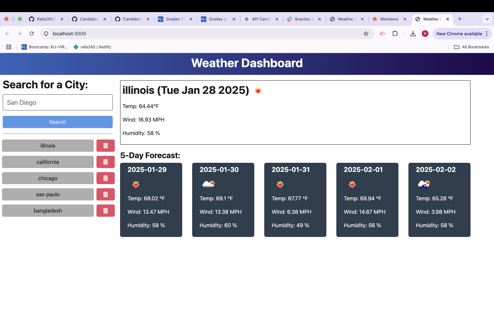

# Weather Dashboard
  
  by Rafael Yuri Guerra
  ## Table of Contents
  - [Description](#description)
  - [Requirements](#requirements)
  - [Usage](#usage)
  - [Contact-Me](#contact-me)
  - [Contributors](#contributors)
  - [Testing](#testing)
  ## Description
  Weather dashboard application that calls the OpenWeather API and renders data in the browser, will show users a 5 day weather forecast depending on the city that they select.
  ## Requirements
  Understading of Typescript, Javascript, Node.js, HTML, CSS
  ## Usage
  User is able to connect to a Weather Api database, where once they choose a city they will be prompted with the cities six key categories (city name, date, weather icon with the weather description in the alt tag, current temperature, current humidity, and wind speed) are displayed.
  ## Contact-Me
  * Name - Rafael Yuri Guerra
  * Email - rafaguerra245@hotmail.com
  * GitHub - [Rafa245](https://github.com/Rafa245)
  ## Contributors
  ChatGpt 
  ## Testing
  Open the project and when in the root type "npm run dev" to get the project running.

  Link to project: https://github.com/Rafa245/Weather-Dashboard-09-

  License: MIT 

  https://opensource.org/licenses/MIT

  
  
